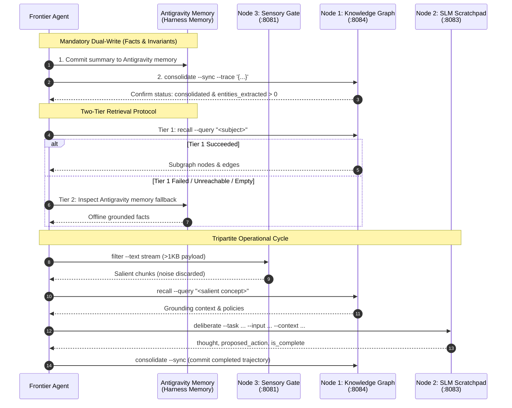

# Cluster Memory Skill

The **Cluster Memory Skill** governs distributed cognitive workflows across a dedicated tri-node edge computing cluster. It interfaces exclusively through the compiled Go CLI harness [`sekha-cluster-tool`](https://github.com/Duara-Cortex/sekha-cluster-tool) to eliminate behavioural drift, enforce dual-memory persistence redundancy, and guarantee strict contract compliance.

---

## 🏛️ Cognitive Topology & Architecture

The architecture coordinates a **Dual-Memory Persistence Hierarchy** coupled to a **Tripartite Cognitive Model**:

1. **Dual-Memory Persistence Hierarchy**:
   - **Antigravity Auto-Memory Tier**: Antigravity's persistent agent memory provides immediate, offline-resilient, deterministic state persistence directly within the agent harness (resolved via the Harness Auto-Memory Resolution Rule; never the user's working directory or repository).
   - **Sekha Remote Cluster Tier**: The tri-node edge cluster provides high-dimensional associative knowledge graph storage, relational edge linking, and episodic consolidation.

2. **Tripartite Edge Processing Nodes**:
   - **Node 3 &bull; Sensory Attention Gate** (`:8081`): High-throughput salience filter and CPU entropy gate for noise reduction ($< 1\text{ ms}$).
   - **Node 2 &bull; Working Scratchpad** (`:8083`): Dedicated local Small Language Model (SLM) inference engine for multi-step hypothesis deliberation.
   - **Node 1 &bull; Knowledge Graph & Episodic Store** (`:8084`): Persistent relational graph, vector indices, Hebbian reinforcement, and episodic decay daemon.



### Physical Node Allocation
- **Node 3** (`4GB RAM`): Hosts the in-memory ring buffer daemon and sensory attention gate on port `:8081`.
- **Node 2** (`16GB RAM`): Hosts the working memory scratchpad and local SLM inference engine on port `:8083`.
- **Node 1** (`8GB RAM`): Hosts the persistent knowledge graph store, vector indices, and consolidation daemon on port `:8084`.

---

## 📋 Prerequisites & Tooling

1. **Compiled Binary**: `sekha-cluster-tool` ($\ge \text{v1.0.1}$) must be installed and executable in the system `PATH`.
   - Verify installation:
     ```bash
     sekha-cluster-tool --help
     ```
   - Release installer:
     ```bash
     curl -fsSL https://raw.githubusercontent.com/Duara-Cortex/sekha-cluster-tool/main/scripts/install.sh | bash
     ```

2. **Decoupled Configuration**:
   - Zero IP addresses are hardcoded in the codebase, skill files, or agent output.
   - Endpoint addresses default to blank (`""`) and must be supplied via local environment configuration.
   - Initialise a starter `.env` file when configuring a new environment:
     ```bash
     sekha-cluster-tool env init
     ```
   - Inspect resolved configuration and precedence:
     ```bash
     sekha-cluster-tool env show
     ```

### Environment Configuration Variables
```env
# Sensory Attention Layer (Node 3)
CLUSTER_SENSORY_URL=http://<sensory-node>:8081

# Working Memory Scratchpad Layer (Node 2)
CLUSTER_WORKING_URL=http://<working-node>:8083

# Long-Term Knowledge Graph Layer (Node 1)
CLUSTER_KNOWLEDGE_URL=http://<knowledge-node>:8084

# Timeout Budgets (milliseconds)
CLUSTER_DEFAULT_TIMEOUT_MS=1500
CLUSTER_DELIBERATE_TIMEOUT_MS=45000

# Attention & Recall Hyperparameters
CLUSTER_SALIENCE_THRESHOLD=0.45
CLUSTER_RECALL_TOP_K=5
```

Configuration resolution adheres strictly to 12-factor standard precedence:
1. Explicit CLI Flags (`--sensory-url`, `--working-url`, `--knowledge-url`)
2. Operating System Environment Variables
3. Local `.env` file (loaded from working directory, `--env-file`, or `~/.config/sekha-cluster-tool/.env`)
4. Compile-time injected builder defaults
5. Blank fallback (`""`)

---

## 💾 Mandatory Dual-Memory Persistence (Dual-Write Contract)

Writing facts exclusively to the remote cluster introduces a fatal single point of failure: network partitions or daemon maintenance cause total amnesia. To guarantee offline survivability and distributed associative recall, the agent **MUST enforce dual-write redundancy**.

### The Dual-Write Mandate
Whenever instructed to **memorise (memorize)**, **store**, **remember**, or **record** critical project facts, configurations, credentials, or architecture invariants, the agent **MUST execute two coordinated writes**:

1. **Write to Antigravity auto-memory**:
   - Commit the structured key-value summary directly to Antigravity's persistent agent harness memory (resolved via the Harness Auto-Memory Resolution Rule). Never create extraneous memory files in the user's working directory or repository.
2. **Write to Sekha cluster memory**:
   - Commit the episodic trace via `sekha-cluster-tool consolidate --sync --trace '...'`.

### Harness Auto-Memory Resolution Rule
Before reading or writing local harness memory, the agent must resolve the target directory using the following preference order:
1. **Harness App Data Memory (Primary & Most Specific)**: `~/.gemini/antigravity-cli/memory/` (may be exposed via `$APP_DATA_DIR/memory/` or harness configuration).
2. **Global Gemini Memory Fallback**: `~/.gemini/memory/`.

> [!IMPORTANT]
> **Working-Directory Boundary & Preflight Check**:
> - The agent **MUST check which directory actually exists before writing**, because a write to a path the harness never reads back is silently lost.
> - **Never the user's working directory or repository**: Under no circumstances may the agent fall back to writing memory files, notes, or scratchpads into the active project workspace or repository.
> - **Missing Candidate Action**: If neither candidate directory exists or the location cannot be determined, do not invent a location; the agent must halt and ask the operator where harness memory lives.

### State Classification & Trigger Rules

| State Classification | Definition & Scope | Persistence Action |
| :--- | :--- | :--- |
| **Transient Scratchpad State** | Ephemeral loop counters, intermediate tool output, draft reasoning thoughts, temporary debug logs, uncommitted candidate actions. | **Local session only.** Do NOT write to long-term memory or Sekha cluster consolidation. |
| **Project Invariants & Grounding Facts** | Architectural constants, project configurations, service credentials, environment parameters, operational policies, permanent system constraints, cross-session user decisions. | **Mandatory Dual-Write.** MUST be committed to Antigravity auto-memory (resolved harness directory; never the user's working directory or repository) AND consolidated to Sekha cluster memory. |

### Dual-Write Execution Pattern

#### Step 1: Commit to Antigravity Auto-Memory
Store the invariant in Antigravity's resolved agent auto-memory directory (never the user's working directory or repository):
```markdown
## <Subject> Configuration
- <PARAM_1>: <value_1>
- <PARAM_2>: <value_2>
- Recorded: <now UTC>
```

#### Step 2: Commit to Sekha Cluster Memory
Execute the single-line inline consolidation command (no heredocs, subshells, or temporary files):
```bash
sekha-cluster-tool consolidate \
  --session-id "sess-memorise-<subject>" \
  --goal "Store <Subject> configuration" \
  --anchor "#project:<subject>" \
  --sync \
  --trace '{"session_id":"sess-memorise-<subject>","task_goal":"Store <Subject> configuration","outcome":"success","status":"completed","sensory_context":[{"id":"fact-01","text":"<Subject> config: <PARAM_1>: <val>; <PARAM_2>: <val>; ...","salience":1.0,"source":"user","timestamp":"<now UTC>"}],"trajectory":[{"step_index":0,"thought":"Committed <Subject> configuration to long-term memory","status":"completed","timestamp":"<now UTC>"}]}'
```

> [!IMPORTANT]
> **Categorical Anchoring**: You **MUST** specify `--anchor "#project:<subject>"` during consolidation. An unanchored write is reachable only by similarity ranking and can never be returned by `--anchor-mode filter`. If an anchor is omitted at write time, downstream queries using `--anchor "#project:<subject>" --anchor-mode filter` will fail to isolate the entity in the graph.

#### Step 3: Verification & Read-Back Contract
The agent must verify that:
1. **Auto-memory written**: The Antigravity auto-memory entry has been recorded in the resolved agent harness directory (never the user's working directory or repository).
2. **Cluster write confirmed**: The cluster tool response confirms `"status": "consolidated"` and `entities_extracted > 0`. (Note: `"status": "consolidated"` and `entities_extracted > 0` confirm that the write was processed, but do NOT guarantee associative recallability.)
3. **Read-back verification (mandatory)**: Run a recall query for a distinctive phrase:
   ```bash
   sekha-cluster-tool recall --query "<distinctive subject phrase>" --top-k 3
   ```
   Confirm that the expected entity surfaces with sufficient `sim_score`. If it does not surface, report the fact as persisted to Antigravity auto-memory (resolved harness directory; never the user's working directory or repository) but not reliably retrievable from the cluster &mdash; **do not claim full dual-redundancy**.

> [!WARNING]
> **Plaintext Credential Notice**: If storing credentials, tokens, or private endpoints, explicitly inform the operator that credentials reside in plaintext within the agent auto-memory and the Node 1 knowledge graph store.

---

## 🔍 Two-Tier Retrieval Protocol (Cluster-First with Local Fallback)

When recalling facts, configurations, or operational guidelines across sessions, agents must follow a strict two-tier retrieval hierarchy:

```
[Recall Trigger] ──► Tier 1: Sekha Cluster Recall (:8084)
                            │
              ┌─────────────┴─────────────┐
              ▼                           ▼
      [Hit with Valid Score]      [Empty / Error / Unreachable]
              │                           │
              ▼                           ▼
      [Ground Reasoning]          Tier 2: Antigravity Memory Fallback
                                          │
                                  ┌───────┴───────┐
                                  ▼               ▼
                            [Found in Memory]  [Not Found]
                                  │               │
                                  ▼               ▼
                          [Ground Reasoning]  [Decline Honestly]
```

### Tier 1: Sekha Cluster Recall (Primary)
1. **Query Execution**:
   ```bash
   sekha-cluster-tool recall --query "<subject name>" --top-k 8
   ```
2. **Entity Extraction & Similarity Ranking**:
   - Inspect the `nodes` array for matching `sensory_fact` nodes.
   - **Rank strictly by `sim_score`**, NOT by composite `score`. Composite `score` combines vector similarity ($\alpha$) with access frequency ($\beta$) and recency ($\gamma$). On a populated graph, heavily accessed or recent unrelated nodes (such as credentials, admin keys, or system policies) can easily outscore a verbatim match with low access counts.
   - **Forbid grounding on near-zero or null `sim_score`**: Never ground on a top-ranked node whose `sim_score` is near zero, `null`, or absent. A frequently-accessed entity outranking a verbatim match on composite `score` is the primary signature of ranking skew; treating the highest composite `score` as the best match in this state is a critical error.
   - Extract parameters verbatim from the `summary` field (never rely on truncated `label` fields).
3. **Retrieval Escalation Ladder**:
   If the target subject does not surface with high `sim_score`, or if matches are weak/ambiguous, work the escalation ladder systematically before declaring a miss or falling back to Tier 2:
   - **Step 1 (Pure Similarity Re-ranking)**: Override frequency/recency weighting to isolate semantic vector match:
     ```bash
     sekha-cluster-tool recall --query "<subject name>" --alpha 1.0 --beta 0 --gamma 0 --top-k 5
     ```
     *(Note: Pure-similarity re-ranking with `--alpha 1.0` is an escalation fallback, not a new default. It fixes ordering by stripping frequency and recency bias, but does not improve underlying semantic confidence.)*
   - **Step 2 (Key Parameter Re-query)**: Re-query by appending expected parameter keys to the query string:
     ```bash
     sekha-cluster-tool recall --query "<Subject> config: <PARAM_1> <PARAM_2>" --top-k 5
     ```
   - **Step 3 (Relational Expansion)**: Expand traversal depth across connected edges:
     ```bash
     sekha-cluster-tool recall --query "<subject name>" --hops 2 --top-k 8
     ```
   - **Step 4 (Categorical Anchor Filtering)**: Filter explicitly by anchor tag:
     ```bash
     sekha-cluster-tool recall --query "<subject name>" --anchor "#project:<subject>" --anchor-mode filter --top-k 5
     ```
   - **Step 5 (Escalate to Tier 2)**: If all steps fail or yield low confidence, immediately escalate to **Tier 2 Antigravity Memory Fallback** (resolved harness memory; never the user's working directory or repository).
   - **Anti-Pattern Guard**: **Never report "not found" directly from a default-weighted query that returned weak matches.** You must work through the escalation ladder before declaring a Tier 1 miss.
4. **Token Hygiene**:
   - Strip the dense 64-D float `"embedding"` array when assembling the working context.

### Tier 2: Antigravity Memory Fallback (Secondary)
1. **Fallback Triggers**:
   - Tier 1 encounters a connection failure, timeout, or unreachable endpoint (`dial tcp: connection refused`, i/o timeout).
   - Tier 1 returns zero matches (`"nodes": []`) or entities unrelated to the target subject.
   - Endpoint configuration is blank or reports service degradation.
2. **Fallback Inspection**:
   - Immediately inspect Antigravity's persistent agent harness memory (resolved via the Auto-Memory Resolution Rule; never the user's working directory or repository).
   - Extract the grounded parameters directly from the agent harness memory.
   - Transparently notify the operator that cluster recall was bypassed or degraded and values were recovered from Antigravity auto-memory.
3. **Strict Grounding Rule**:
   - Ground decisions **exclusively** in verified facts retrieved from Tier 1 or Tier 2.
   - **Never hallucinate unretrieved values** or substitute parameters from unrelated entities. If neither tier holds the fact, decline honestly.

---

## ⚙️ Tripartite Operational Directives & Commands

Agents must actively engage all three physical nodes in accordance with their architectural purpose, rather than treating Sekha merely as a key-value store for Node 1.

### 1. Node 3: Sensory Attention Gating (`filter`)

> [!IMPORTANT]
> **Sensory Gating Mandate**: You **MUST** invoke `sekha-cluster-tool filter` before reading raw logs, error streams, sensor telemetry, or verbose API payloads exceeding 1KB into context. Never ingest raw, un-filtered bursts (>1KB) directly into frontier LLM context.

- **Purpose**: Discards routine keepalive noise, isolates anomalous chunks, and bounds prompt token usage.
- **Invocation**:
  ```bash
  sekha-cluster-tool filter \
    --text "<raw telemetry stream>" \
    --directive "Identify operational anomalies" \
    --threshold 0.45
  ```
- **Rules**:
  - Carry forward only the returned salient `chunks`; discard background noise.
  - Report `reduction_rate`, `noise_discarded`, and `latency_ms` to the operator.
  - If `salient_chunks` is 0, conclude explicitly that no signal exceeded the salience threshold; **never manufacture artificial signal**.
- *Schema details: [schema/filter.json](./schema/filter.json)*

### 2. Node 2: Working Memory Deliberation (`deliberate`)

> [!IMPORTANT]
> **Working Scratchpad Mandate**: You **MUST** invoke `sekha-cluster-tool deliberate` for speculative multi-step hypothesis evaluation, diagnostic root-cause analysis, or tactical decision trees before executing actions. Offload speculative planning to the local edge SLM on Node 2 rather than consuming cloud frontier LLM tokens.

- **Purpose**: Evaluates candidate actions, reasons over operational policies, and tracks sequential steps in a local SLM scratchpad.
- **Invocation**:
  ```bash
  sekha-cluster-tool deliberate \
    --task "<task objective>" \
    --input "<sensory observation>" \
    --context "<retrieved facts and policy guidelines>" \
    --timeout 45s
  ```
- **Rules**:
  - Edge SLM inference on Node 2 typically requires 25–35 seconds; **always pass `--timeout 45s`** to avoid premature timeout failures.
  - **Contamination Check (Mandatory)**: `"status": "ok"` is not sufficient. The working-memory trajectory is held in memory across sessions, is not reset between sessions, and is **not cleared by consolidation** &mdash; a successful `consolidate` leaves the trajectory intact and continuously accumulating. A scratchpad daemon that has been running for days replays accumulated trajectory as context and returns `"status": "ok"` with fluent reasoning about someone else's prior episode.
    **Reject the deliberation immediately if:**
    1. `trajectory_length` or `step_index` far exceeds what the current session performed (e.g. `trajectory_length: 15` on a one-step session).
    2. `prompt_tokens` is grossly disproportionate to the input supplied (e.g. ~1,595 prompt tokens for a one-sentence input is stale trajectory, not reasoning).
    3. `thought` references entities, figures, or concepts that appear nowhere in `--task`, `--input`, or `--context`.
    **Never relay the contaminated `thought` or its `proposed_action` as a finding or recommendation**, however fluent it reads. Because `"status": "ok"` makes this the most dangerous failure mode in the suite, report the deliberation as unusable and state that no valid deliberation was obtained.
  - **Remedy (Clear It in Place)**: The scratchpad exposes an in-place reset endpoint. The CLI has no equivalent subcommand, so this is reachable only over HTTP:
    ```bash
    curl -X POST "$CLUSTER_WORKING_URL/api/v1/working/clear"
    # {"message":"working memory scratchpad reset","status":"cleared"}
    ```
    Re-probe afterwards with a deliberation query and confirm that `trajectory_length` has reset before proceeding. Restarting the scratchpad service also clears it but tears down the process and breaks in-flight requests &mdash; prefer the in-place HTTP endpoint, and keep daemon restart strictly as a fallback.
  - **Proactive Task-Start Clearing Mandate**: Clear the scratchpad at the start of each distinct task or session, not only when contamination is visible. By the time reasoning visibly drifts, false positives have already occurred. The reset call is cheap and idempotent.
  - Evaluate `thought`, `proposed_action`, and `is_complete`.
  - If `is_complete` is `false`, iterate by feeding the prior `proposed_action` result back as the next `--input`.
  - Only execute external actions once deliberation reaches terminal completion (`is_complete: true`).
- *Schema details: [schema/deliberate.json](./schema/deliberate.json)*

### 3. Node 1: Long-Term Knowledge Graph (`recall` & `consolidate`)

- **Associative Recall (`recall`)**:
  - Query the long-term relational graph on Node 1 for grounding policies, topological dependencies, and past episode resolutions:
    ```bash
    sekha-cluster-tool recall \
      --query "<salient concept or entity>" \
      --top-k 5
    ```
  - **Rank strictly by `sim_score`** (never composite `score`). **Forbid grounding on a top-ranked node whose `sim_score` is near zero, `null`, or absent** (a frequently-accessed node outranking a verbatim match on composite `score` indicates ranking skew). Evaluate relational `edges` to understand system topology. Follow the Retrieval Escalation Ladder if ranking is ambiguous or `sim_score` is weak.
  - *Schema details: [schema/recall.json](./schema/recall.json)*

- **Episodic Consolidation (`consolidate`)**:
  - Commit completed reasoning trajectories, actions, and outcomes to Node 1 for graph fusion, Hebbian reinforcement, and background decay:
    ```bash
    sekha-cluster-tool consolidate \
      --goal "<task objective>" \
      --outcome "success" \
      --session-id "<session id>" \
      --anchor "#project:<subject>" \
      --sync
    ```
  - **Categorical Anchoring**: Always pass `--anchor "#project:<subject>"` on `consolidate` so the fact can be scoped precisely at recall. An unanchored write is reachable only by similarity ranking and can never be returned by `--anchor-mode filter`.
  - For configuration memorisation, **always supply the full `--trace` JSON** per the Dual-Write Contract.
  - *Schema details: [schema/consolidate.json](./schema/consolidate.json)*

### 4. Unified Closed-Loop Pipeline (`orchestrate`)

- **Directive**: Use `sekha-cluster-tool orchestrate` whenever an end-to-end cognitive turn (Stream $\to$ Filter $\to$ Recall $\to$ Deliberate $\to$ Consolidate) is required in one shot.
- **Invocation**:
  ```bash
  sekha-cluster-tool orchestrate \
    --input "<raw sensory stream>" \
    --directive "<attention directive>" \
    --anchor "#project:<subject>" \
    --trace-id "<trace id>" \
    --sync
  ```
- **Rules**:
  - Automatically correlates all 4 stages under a single distributed `X-Trace-ID`.
  - **Never read top-level `status` as success**: A top-level `"status": "completed"` describes pipeline execution completion, NOT turn or deliberation success. Always check `is_complete`, `final_thought`, and Stage 3 (`deliberate`) status in `stages[]`.
  - **Treat placeholder action as failed turn**: A fallback `final_thought` (such as `"Deliberation service unreachable; fallback to direct response"`) accompanied by a placeholder `proposed_action` (such as `AWAIT_STABILISATION`) and `is_complete: false` represents a **failed turn**. Never report turn success, and never present `AWAIT_STABILISATION` as an action to carry out or schedule.
  - **Consolidation Consequence**: Because all 4 stages execute in-process within the tool backend, Stage 4 (`consolidate`) commits automatically even when Stage 3 deliberation fails or times out. A degraded episode with placeholder reasoning has entered the knowledge graph under the active `session_id`/`trace_id` and will surface in future recalls. Note that the CLI exposes no delete, rollback, prune, or archive subcommand, so there is no remediation path through the tool.
  - **Deliberation Timeout Budgeting**: Passing `--timeout 45s` to `orchestrate` sets the total CLI timeout, **NOT** the Stage 3 deliberation budget. Stage 3 deliberation takes its budget **strictly from `CLUSTER_DELIBERATE_TIMEOUT_MS`** in configuration / `.env`. Ensure `CLUSTER_DELIBERATE_TIMEOUT_MS=45000` is set in `.env` to prevent premature deliberation cuts.
  - Inspect `stages[]` array in the JSON response to verify the per-stage execution status (`filter`, `recall`, `deliberate`, `consolidate`).
- *Schema details: [schema/orchestrate.json](./schema/orchestrate.json)*

### 5. Large File & Stream Handling Protocol (`--file` and File Traces)

> [!TIP]
> **Large File Safety**: When sensory inputs, telemetry streams, diagnostic dumps, or code documents exceed 1KB or span multiple lines, **never pass them as raw inline shell strings** (which risk escaping errors and shell `ARG_MAX` buffer limits).

- **File-Based Sensory Filtering (`filter --file`)**:
  Pass large log files or streams directly via `--file <path>` (or `-` for stdin):
  ```bash
  sekha-cluster-tool filter \
    --file /path/to/sensory_stream.log \
    --directive "Isolate anomalous operational events" \
    --threshold 0.45
  ```
- **File-Based Orchestration (`orchestrate --file`)**:
  Execute the full 4-stage pipeline against raw files:
  ```bash
  sekha-cluster-tool orchestrate \
    --file /path/to/large_payload.txt \
    --directive "Analyse telemetry and formulate mitigation" \
    --sync
  ```
- **File-Based Trace Consolidation (`consolidate --trace`)**:
  When committing large deliberation traces containing extensive sensory context or trajectories, write the trace JSON to a file in your scratch directory and pass the path to `--trace`:
  ```bash
  sekha-cluster-tool consolidate \
    --session-id "sess-large-trace" \
    --goal "Consolidate complex diagnostic episode" \
    --trace "/path/to/trace.json" \
    --sync
  ```

### 6. Cluster Health & Deliberation Preflight Probe (`status` & probe)

- **Network Reachability Probe (`status`)**:
  Probe reachability and measure roundtrip network latency across all three endpoints before critical runs:
  ```bash
  sekha-cluster-tool status
  ```
- **Deliberation Preflight Probe (Health ≠ Working)**:
  `status` probes only `/api/v1/memory/health` and `/api/v1/working/health`, which check daemon HTTP liveness and report `all_nodes_healthy` even when SLM inference is deadlocked or saturated. Before launching complex multi-turn workflows or expensive orchestrations:
  1. Clear any stale scratchpad trajectory in place:
     ```bash
     curl -s -X POST "$CLUSTER_WORKING_URL/api/v1/working/clear"
     ```
  2. Execute a deliberation probe:
     ```bash
     sekha-cluster-tool deliberate --task "probe" --input "ping" --timeout 45s
     ```
  3. Verify that the probe returns `"status": "ok"` with `step_index: 0` or `1`, and passes the Contamination Check (`trajectory_length <= 3`, prompt tokens commensurate with input).

---

## 📖 Progressive Disclosure & Reference Links

- **Payload Contracts**:
  - [Sensory Filter Schema](./schema/filter.json) &mdash; Request and response specifications for Stage 1.
  - [Associative Recall Schema](./schema/recall.json) &mdash; Knowledge graph query and subgraph response for Stage 2.
  - [Working Deliberation Schema](./schema/deliberate.json) &mdash; Scratchpad reasoning step and candidate action contracts for Stage 3.
  - [Episodic Consolidation Schema](./schema/consolidate.json) &mdash; Graph fusion receipt specifications for Stage 4.
  - [Closed-Loop Orchestration Schema](./schema/orchestrate.json) &mdash; Unified multi-stage execution and telemetry contracts.
- **Walkthrough Examples**:
  - [Unified Closed-Loop Cycle](./examples/closed-loop-cycle.md) &mdash; Complete multi-node incident response trace.
  - [Staged Invocation Runbook](./examples/staged-invocation.md) &mdash; Step-by-step intermediate execution.
  - [Fault Tolerance & Degraded Fallback](./examples/fallback-degraded.md) &mdash; Resilient handling of node timeouts, dual-memory fallback, and network partitions.
- **Evaluation & Verification**:
  - [Skill Calibration Guide](./eval.md) &mdash; Self-scoring evaluation instructions and scoring rubric links.

---

## 🛡️ Resilience & Degradation Protocols

Follow the tool's timeout budgets ($< 1\text{ s}$ per hop; deliberation up to $45\text{ s}$) and degrade gracefully &mdash; never fabricate a stage result.

1. **Unconfigured Endpoint Guard**:
   - If any endpoint URL resolves to blank (`""`), the agent must halt and prompt the operator to run `sekha-cluster-tool env init` and populate `.env`. Never guess or hardcode addresses.

2. **Sensory Gating Fallback (Node 3 Unreachable)**:
   - If Node 3 encounters a connection failure or timeout, the agent preserves the raw sensory input by treating it as an unranked salient chunk with default unit salience (`1.0`), proceeding directly to Stage 2 (`recall`) without crashing.

3. **Scratchpad Timeout Guard & Trajectory Halting (Node 2 Unresponsive)**:
   - If Node 2 exceeds `CLUSTER_DELIBERATE_TIMEOUT_MS`, the agent flags the degradation, halts the trajectory safely, and notifies the operator. It must never invent synthetic reasoning thoughts or uncommitted candidate actions.
   - **Enforceability across Invocation Modes**:
     - *Staged Path*: The agent controls Stage 4 directly and **MUST halt** before calling `sekha-cluster-tool consolidate`. Do not consolidate an incomplete or timed-out trajectory.
     - *Orchestrate Path*: Because all four stages run in-process within the tool backend, consolidation is not conditional on deliberation success and commits automatically. The agent cannot halt consolidation retroactively once invoked. If deliberation times out or fails during orchestration, the agent must report the polluted `session_id` and `trace_id` to the operator and state that the CLI exposes no rollback or delete subcommand for long-term graph mutations.

4. **Episodic Persistence Redundancy (Node 1 Offline)**:
   - If Stage 4 consolidation fails or Node 1 is offline, the **Dual-Write Contract guarantees zero amnesia**: the fact has already been safely persisted to Antigravity's auto-memory (resolved harness directory; never the user's working directory or repository).
   - The agent records the trace locally for deferred retry once Node 1 connectivity is restored. Primary task completion must not be blocked by background consolidation failures.

5. **Two-Tier Retrieval Degradation (Node 1 Recall Offline or Empty)**:
   - If Node 1 recall fails or returns empty results, immediately execute **Tier 2 Antigravity Memory Fallback** by reading Antigravity's auto-memory (resolved harness directory; never the user's working directory or repository).
   - Never fabricate or guess unretrieved parameters. If neither tier holds the data, decline honestly.

---

## 📐 Governance & Style Discipline

- **Pure British English (`en_GB`)**: All explanatory prose, reports, and documentation must adhere strictly to British English spelling (*initialise*, *serialise*, *optimise*, *neighbour*, *behaviour*, *prioritise*, *memorise*).
- **Frozen Contract Keys**: JSON keys emitted by `sekha-cluster-tool` mirror Go struct tags exactly (`salient_chunks`, `reduction_rate`, `sim_score`, `proposed_action`, `is_complete`, `trace_id`, `stages[]`, `latency_ms`). They must never be altered, re-cased, or anglicised.
- **Latency Budgets**: Sub-second roundtrips ($< 1000\text{ ms}$ per hop) must be verified against telemetry fields (`latency_ms`, `query_latency_ms`, `total_duration_ms`). Deliberations on Node 2 are budgeted up to $45\text{ s}$.
- **CLI Shell Safety**: All inline trace JSON payloads passed to `--trace` must be enclosed in single quotes (`'{"session_id":...}'`) to ensure clean execution under tool allowlists.
